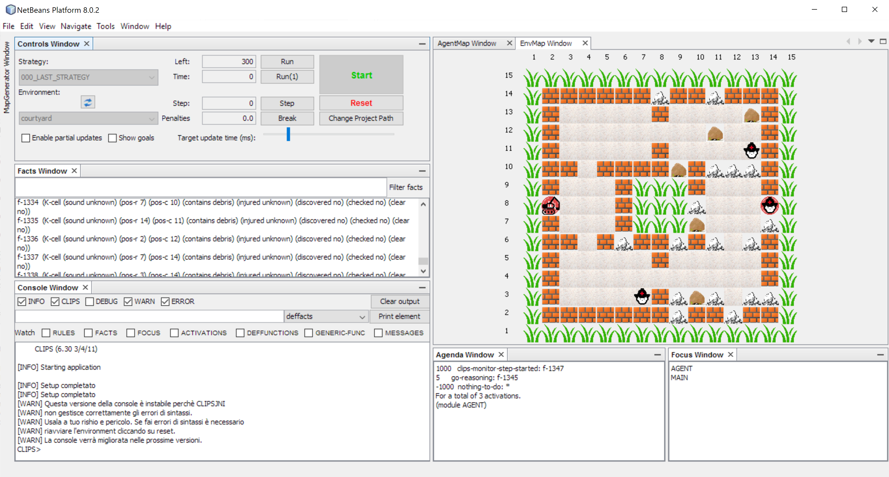
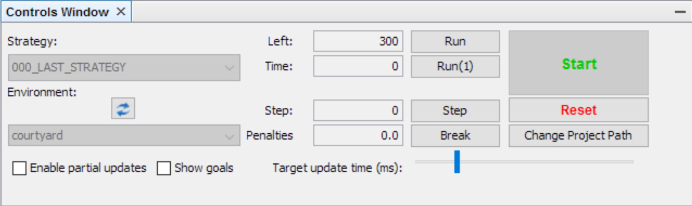
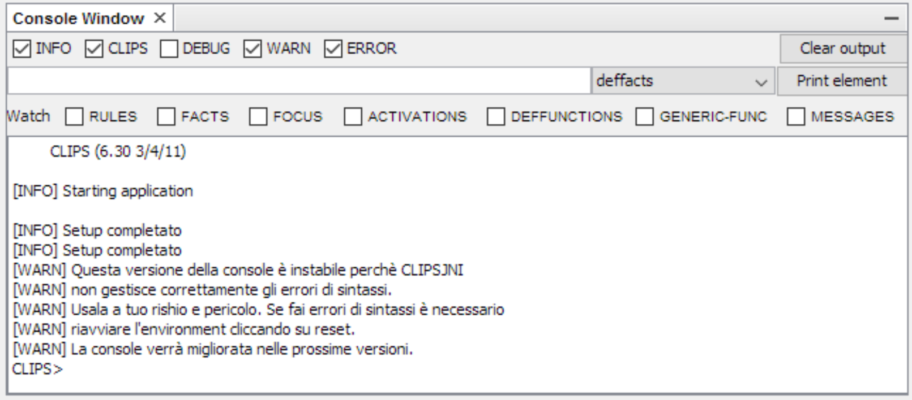

# ClipsMonitor

Un IDE per i progetti di Intelligenza Artificiale del Dipartimento di Informatica di Torino, nato dalle ceneri di [Monitor_NGCaffe](https://github.com/AlexBasile/Monitor_NGCaffe) (di Alessandro Basile e Tobia Giani), con:

Nuove funzionalità:

* **Console CLIPS** integrata per debugging real-time (si può evitare completamente di usare CLIPS IDE)
* **GUI** completamente riprogettata per essere user-friendly
* **Due mappe** distinte per AGENT e ENV
* **Modalità Break** che a differenza di 'Step' e 'Run' si ferma al primo comando `(halt)`
* **Generatore di mappe e history** incorporato
* **Comanda l'agente** forzando delle exec con delle shortcut
* e tante altre....

Maggiori miglioramenti:

* **Utilizza un fork di CLIPSJNI** che permette una gestione più *Umana* degli errori e risolve una serie di crash.
* **Esecuzione molto più veloce**: Run e Step non usano più un ciclo di Run(1) con polling dei fatti, ma sono basate su regole iniettate dall'IDE.
* **Aggiornamento differenziale della mappa**: vengono ridisegnate solo le celle che cambiano
* **Model aggiornato solo quando necessario**
* **Refactoring** massivo del codice, pensato per essere più modulare ed estendibile (per quanto possibile).

> ClipsMonitor è stato pensato per il progetto RESCUE 2014/2015, ma dovrebbe essere facilmente
modificabile e riutilizzabile anche per altri progetti simili.

## Table of contents

* [Per cominciare](#per-cominciare)
	* [1. Installa CLIPSJNI2](#1-installa-clipsjni2)
	* [2. Installa ClipsMonitor](#2-installa-clipsmonitor)
	* [3. Scarica il progetto di prova](#3-scarica-il-progetto-di-prova)
	* [4. Avvia ClipsMonitor](#4-avvia-clipsmonitor)
* [Features](#features)
	* [Controls window](#controls-window)
	* [Env map](#env-map)
	* [Agent map](#agent-map)
	* [Console window](#console-window)
	* [Facts, Agenda e Focus windows](#facts-agenda-e-focus-windows)
	* [Map generator](#map-generator)
	* [Shortcuts](#shortcuts)
* [Setup](#setup)
	* [Configura il tuo progetto](#configura-il-tuo-progetto)
* [Contribuire a ClipsMonitor](#contribuire-a-clipsmonitor)
* [Licenza](#licenza)
* [Aknowledgments](#aknowledgments)

## Per cominciare

#### 1. Installa CLIPSJNI2

Prima di installare ClipsMonitor assicurati di avere installato la libreria nativa [CLIPSJNI2](https://github.com/Chosko/CLIPSJNI)
(è diversa da CLIPSJNI originale!) nel tuo sistema operativo. Le istruzioni sono contenute nel README del repository.

#### 2. Installa ClipsMonitor

[Scarica l'installer relativo all'ultima versione](https://github.com/Chosko/ClipsMonitor/releases)

Una volta scaricato, estrailo ed esegui l'installer relativo alla tua piattaforma.

Se non c'è un installer per la tua piattaforma, dovrai scaricare il codice sorgente e avviare ClipsMonitor utilizzando NetBeans.

#### 3. Scarica il progetto di prova

Il [progetto di prova](https://github.com/Chosko/ClipsMonitor/raw/master/RescueTest.zip) è utile per vedere come funziona ClipsMonitor senza dover configurare un progetto da zero. [Scaricalo](https://github.com/Chosko/ClipsMonitor/raw/master/RescueTest.zip) ed estrailo in una cartella del tuo PC.

#### 4. Avvia ClipsMonitor

Al primo avvio di verrà chiesto di indicare la cartella del tuo progetto. Seleziona il progetto di prova.

> NB: è possibile che al primo avvio non compaiano i comandi di ClipsMonitor. Se succede basta andare sul menù e selezionare `Windows > Reset Windows`

## Features

ClipsMonitor è un IDE basato su Netbeans Platform. Appare come una serie di finestre in un unico layout. Ogni singola finestra può essere ancorata o disancorata in svariati modi.

> NB: In qualunque momento puoi resettare il layout iniziale delle finestre dal menù `Window > Reset Windows`




#### Controls window

Questo pannello permette di eseguire delle funzioni base sul progetto



A sinistra si possono scegliere la **Strategy** e l'**Environment** da caricare. Una volta selezionati, premendo il pulsante **Start** vengono caricati i file su CLIPS e si entra in fase di esecuzione. Premendo il tasto **Reset** si esce dalla fase di esecuzione e si possono nuovamente selezionare Strategy ed Environment.

ClipsMonitor memorizza il percorso del progetto su cui stai lavorando, in modo da non chiederlo ad ogni riavvio. Clicca su **Change Project Path** per cambiarlo.

Una volta in fase di esecuzione:

* **Run** fa partire la simulazione in modalità automatica. Si fermerà solo cliccando di nuovo sullo stesso pulsante (che cambia il nome in **Stop**)
* **Run 1** esegue una singola regola CLIPS. (analogo a `(run 1)` su CLIPS IDE)
* **Step** Fa partire la simulazione in modalità step. Si fermerà automaticamente dopo l'esecuzione di un'azione da parte dell'agente e la successiva acquisizione delle perceptions
* **Break** Permette di lanciare la simulazione in modo che si blocchi a qualunque comando `halt` incontrato.
* **Left** indica il tempo che è rimasto a disposizione dell'agente
* **Time** indica il tempo impiegato dall'agente fino ad adesso
* **Step** indica il numero di step corrente
* **Penalties** sono le penalità accumulate fino ad adesso

#### Env map

E' la mappa reale del mondo, così come vista dal modulo ENV. E' una rappresentazione basata esclusivamente sui fatti `cell`, `agent-status` e `person-status`


#### Agent map

Rappresenta il mondo come lo vede il modulo AGENT. E' una rappresentazione basata esclusivamente sulle percezioni dell'agente, utilizza quindi i fatti `K-cell`, `K-agent` e `K-person`.

E' utilissimo confrontarla con la Env Map per trovare eventuali problemi legati alle percezioni.


#### Console window

E' una delle componenti più utili di ClipsMonitor. Si tratta infatti di una vera e propria console CLIPS, con cui è possibile effettuare un debugging approfondito in real-time.



La parte superiore permette di selezionare quali livelli di output mostrare in console

* **INFO** stampa informazioni base, come l'avvio dell'applicazione
* **CLIPS** stampa tutto ciò che verrebbe stampato eseguendo il codice CLIPS, per esempio le `printout`.
* **DEBUG** stampa informazioni di debug legate all'implementazione di ClipsMonitor. Utile solo se si sta contribuendo allo sviluppo dell'IDE.
* **WARN** stampa informazioni di warning
* **ERROR** stampa gli errori (anche quelli di CLIPS)

Il pulsante **Clear output** pulisce la console

La casella di **input**, unita alla **select** e al punsante **Print element** permettono di stampare il codice di un costrutto CLIPS presente in memoria in quel momento. Nel campo di testo bisogna inserire il nome esatto del costrutto.

Il pannello della console contiene anche un **Prompt** `CLIPS>`, che accetta ed esegue qualunque comando digitato alla pressione del tasto INVIO.

> NB: Questa versione della console è instabile perchè CLIPSJNI non gestisce correttamente gli errori di sintassi. Usala a tuo rischio e pericolo. Se fai errori di sintassi è necessario riavviare l'environment cliccando su reset.

#### Facts, Agenda e Focus windows

Mostrano rispettivamente i fatti, le regole applicabili e lo stack dei moduli attivi.


E' possibile filtrare i fatti cominciando a scrivere nella casella di testo **Filter facts**

#### Map generator

Questa finestra si apre cliccando nello slider sul bordo sinistro di ClipsMonitor.

Questo tool serve per creare mappe personalizzate, salvarle in JSON per poterle modificare successivamente, ed esportarle per CLIPS.

Con questo tool puoi anche gestire le persone e i path che verranno esportati nei file history.txt


Il Map generator prevede due principali modalità di funzionamento attivabili mediante le radio button sottostanti **map** e **move**.

##### Map

Con la modalità Map è possibile creare una mappa personalizzata, indicando le dimensione della griglia atttraverso gli appositi textfield **x** , **y** apposite e modificare i vari elementi della scena utilizzando la comoda *checkbox* **Inserisci**, la quale mostra un anteprima dell'immagine che rappresenta un elemento del dominio.

All'inizio la mappa generata rappresenta una configurazione standard per il vostro progetto, che potrete tranquillamente decidere tramite una classe Java.

Inolte è possibile impostare la posizione iniziale del robot e indicare il time a disposizione dell'agente per completare la sua esecuzione atttraverso
la textfield **maxduration** presente.

Per modificare gli elementi della scena bisogna selezionare un elemento mediante **Inserisci** e successivamente cliccare su una cella della griglia affinchè venga eseeguito l'aggiornamento.

Se invece si desidera modificare la dimensione della griglia o il time a disposizione bisogna digitare il valore desiderato sulle varie textfield e poi successivamente cliccare il pulsante **Aggiorna** affinchè vengano applicate le modifiche.

> NB: Quando eseguite un aggiornamento delle dimensioni della griglia, dovete stare attenti che questo comporta, l'eliminazione di tutti quei movimenti che non sono piu coerenti con la scena. Nel caso in cui siano già stati creati path, una finestra di dialogo comunque vi chiederà una conferma. L'operazione una volta confermata non può essere ANNULATA.

#### Move

Con la modalità Move invece sarete in grado di generare path coerenti su cui far muovere altri agenti all'interno della mappa; potete aggiungere più persone, a cui associare uno o più path di movimento personalizzati, decidere gli intervalli di attesa tra un path e l'altro e infine potete rimuovere sia
interi path, sia singoli movimenti.

Per tenere sotto controllo gli elementi inseriti, potete controllare le pratiche liste **Persons, Persons path, Step , Moves** che vi daranno un prospetto degli elementi inseriti ed inoltre grazie cliccando sugli elementi delle liste è possibile filtrare le move inserite e nel caso del filtro mediante path sarà possibile visualizzarlo direttamente sulla mappa.

Inoltre la mappa farà vedere per ogni Step, la posizione di tutti gli agenti in modo da evitare sovrapposizioni e ottenere quindi una history pulita.

Per inserire una nuova persona bisognerà in prima battuta scegliere un colore sempre mediante la *combobox* **Inserisci**, cliccare su un punto della mappa da cui si vuol far partire la person, e successivamente cliccare sul pulsante **Aggiungi** immediatamente sotto la lista **Person**; in caso la si voglia eliminare bisogna utilizzare il pulsante **Rimuovi** sempre al di sotto della lista Person.

Una volta inserita, possiamo iniziare a costruire un primo path, utilizzando esclusivamente la mappa. Cliccando su una cella attigua a dove compare l'icona dell'agente, si chiede al map generator di *spostare* l'agente in una nuova posizione e questo identifica un nuovo movimento che verrà aggiunto.

Una volta aggiunto un passo, è comunque sempre possibile, eliminare l'ultima mossa eseguita, semplicemente cliccando sull'icona dell' agente e quest'ultimo
retrocederà di un passo.
Ad ogni aggiunta di passo o rimozione, vedrete sempre il resto degli agenti inseriti in modo aver sempre chiaro, lo sviluppo della history.

Se ad una persona vogliamo associar più di un path allora tenendo su **Inserisci** il colore corrispondente possiamo cliccare il pulsante **Aggiungi** posto sotto la lista **Path** e da quel momento quando ci muoveremo sulla mappa tutti i passi inseriti saranno aggiunti al nuovo path corrente.

Per rendere totale la flessibilità di costruzione delle history è stata aggiunta una *textfield* **Wait time** la quale viene utilizzata dal map generator in fase di aggiunta del nuovo path come intervallo di tempo (misurato in step) in cui la person resta ferma sulla mappa prima di iniziare una nuova sequenza di passi.


#### Shortcuts

**Azioni base**

* **CTRL+R**: Run
* **CTRL+T**: Run(1)
* **CTRL+S**: Step
* **CTRL+B**: Break

**Inviare comandi all'agente**

* **CTRL+ALT+W**: Send action -> forward
* **CTRL+ALT+A**: Send action -> turnleft
* **CTRL+ALT+D**: Send action -> turnright
* **CTRL+ALT+S**: Send action -> wait
* **CTRL+SHIFT+W**: Send action -> drill north
* **CTRL+SHIFT+A**: Send action -> drill west
* **CTRL+SHIFT+D**: Send action -> drill east
* **CTRL+SHIFT+S**: Send action -> drill south
* **CTRL+SHIFT+ALT+W**: Send action -> load (or unload) north
* **CTRL+SHIFT+ALT+A**: Send action -> load (or unload) west
* **CTRL+SHIFT+ALT+D**: Send action -> load (or unload) east
* **CTRL+SHIFT+ALT+S**: Send action -> load (or unload) south

> NB: Tutte le shortcut funzionano solo se la finestra **Controls** è visibile.


## Setup

#### Configura il tuo progetto

Quando sei pronto per cominciare con il progetto reale, devi configurarlo in modo che abbia la stessa forma del [progetto di prova](https://github.com/Chosko/ClipsMonitor/raw/master/RescueTest.zip).

La struttura delle directory deve essere fatta in questo modo:

```yaml
- CLP # Questa cartella contiene i file di clips organizzati per strategie
  - STRATEGIA1 # Ogni cartella è una strategia diversa. I nomi delle strategie sono arbitrari
    - 0_Main.clp
    - 1_Env.clp
    - 2_Agent.clp
    - ...
  - STRATEGIA2
    - ...
  - ...
- envs # Questa cartella contiene i diversi ambienti di test in cui provare l'agente
  - env1 # Ogni cartella è un ambiente diverso e deve contenere il file RealMap.txt e il file history.txt
    - RealMap.txt
    - history.txt
  - env2
  - ...
- img # Questa cartella contiene le immagini utilizzate da ClipsMonitor per renderizzare la mappa
```

La cartella `img` puoi copiarla integralmente dal progetto di prova.

## Contribuire a ClipsMonitor

Chiunque può contribuire a ClipsMonitor.

Se vuoi segnalare un problema o hai una richiesta, [apri una issue su GitHub](https://github.com/Chosko/ClipsMonitor/issues).

Se invece vuoi contribuire modificando il codice, fai un fork del progetto e a modifiche ultimate [crea una pull request](https://github.com/Chosko/ClipsMonitor/pulls)

NB: non verranno accettate modifiche che sono *dipendenti dall'implementazione personale* del progetto CLIPS.

Riceveranno una priorità massima tutte le modifiche che mirano a:

* **risolvere bug**
* **implementare nuove funzionalità** indipendenti dal singolo progetto CLIPS
* **astrarre** i componenti di ClipsMonitor dall'implementazione del progetto CLIPS

## Licenza

[GNU General Public License v2](https://github.com/Chosko/ClipsMonitor/blob/master/LICENSE)

## Aknowledgments

Per realizzare questo progetto è stato utilizzato come punto di partenza il progetto [Monitor_NGCaffe](https://github.com/AlexBasile/Monitor_NGCaffe) di Alessandro Basile e Tobia Giani.
